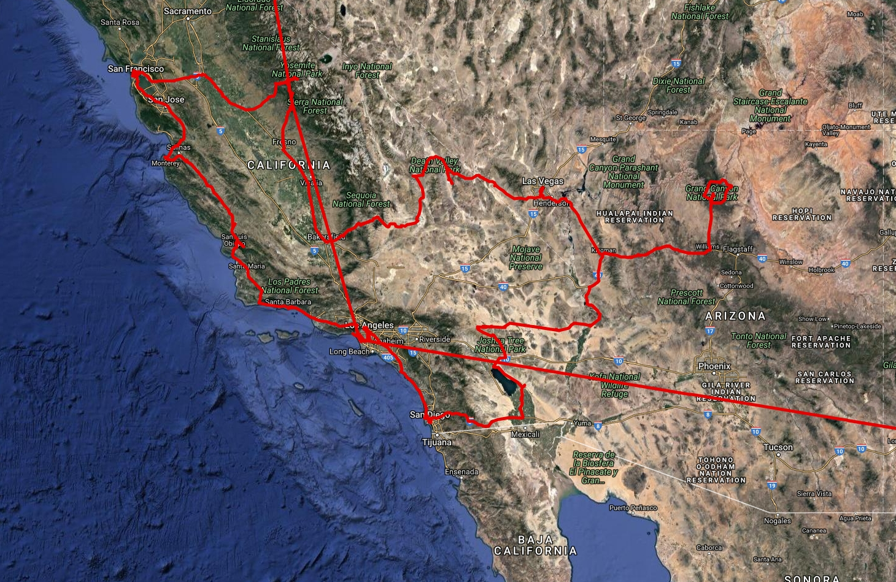

# maps
A tool for viewing and inspecting google maps timeline data.

# Example
A map generated from a subset of google timeline data for a trip around california.

To use:

  Download some google maps location data. Then run scripts/parser.py with your locations json file as the -l argument
  This will generate a file markers/markers.js
  Then open web/map.html

  for example run the following from the project root:

    python scripts/parser.py -l gpsdata/locationsCalifornia.json
    xdg-open web/map.html
